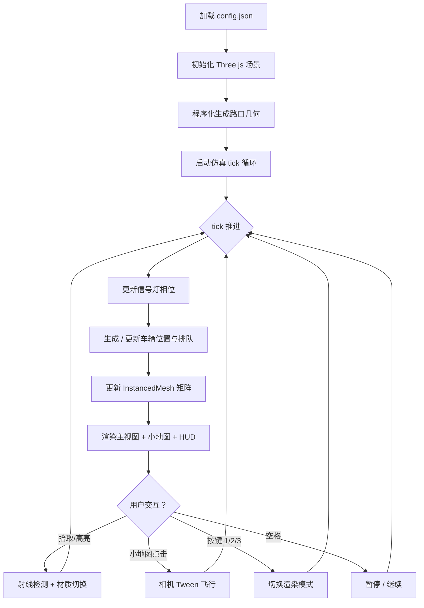

## 1. 产品概述
基于 Three.js + Vite + TypeScript 的十字路口交通 3D 可视化模拟系统，纯程序化生成场景，无外部 GLTF 资源。面向交通仿真、城市规划演示场景，提供直观的车流、信号、排队可视化能力。

## 2. 核心功能

### 2.1 用户角色
无需多角色区分，单用户桌面端交互即可。

### 2.2 功能模块
1. **3D 场景主视图**：十字路口、车辆、信号灯实时渲染
2. **交通仿真引擎**：固定 tick 推进、四向车流生成、均速与排队逻辑
3. **信号控制系统**：4 相位信号灯，config.json 可配置各相位时长
4. **交互拾取系统**：车道 / 车辆射线拾取，hover 高亮
5. **顶视小地图**：右上角正交顶视图，点击进口道相机 tween 飞行
6. **HUD 数据面板**：当前选中方向最近 60 tick 车流量折线图
7. **可视化模式切换**：粒子 / 热力 / 线框三种渲染模式（1/2/3 键）
8. **全局控制**：空格暂停 / 继续、OrbitControls 限俯仰角

### 2.3 页面细节
| 页面名称 | 模块名称 | 功能描述 |
|-----------|-------------|---------------------|
| 主场景页 | 3D 路口渲染 | 程序化生成双向多车道道路、停止线、人行道、路缘石 |
| 主场景页 | 车辆渲染 | InstancedMesh 批量渲染，同屏 ≤ 300 辆 |
| 主场景页 | 信号灯 | 4 相位灯组（南北直行 / 南北左转 / 东西直行 / 东西左转），停止线前排队可视化 |
| 主场景页 | 小地图 | 右上角 2D 顶视缩略图，点击四向进口道相机平滑过渡 |
| 主场景页 | HUD 折线图 | 选中方向最近 60 tick 车辆通过数 / 排队长度折线 |
| 主场景页 | 键盘控制 | 空格暂停、1/2/3 切换粒子/热力/线框模式 |

## 3. 核心流程
用户打开页面 → 加载 config.json 信号相位配置 → 初始化 Three.js 场景、相机、控制器 → 程序化生成路口几何 → 启动仿真 tick 循环 → 每帧更新 InstancedMesh 矩阵 / HUD 数据 → 用户交互（hover 拾取高亮 / 小地图点击 tween / 按键切换模式或暂停）

## 4. 用户界面设计

### 4.1 设计风格
- **主色调**：深灰沥青路面（#2a2a2e）、白黄标线（#ffffff / #facc15）、浅灰人行道（#9ca3af）、信号灯红黄绿（#ef4444 / #eab308 / #22c55e）
- **配色辅助色**：车辆随机调色板（蓝、红、银、黑、白），热力模式使用 viridis 渐变色带
- **整体氛围**：工程化 / 数据可视化风，克制的深色主题 HUD 叠加层，无边框半透明玻璃态面板
- **字体**：JetBrains Mono 等宽字体（HUD 数据）+ 无衬线系统字体（中文标签）
- **按钮 / 面板**：圆角 6px、半透明 rgba(15,23,42,0.75) 背景、0.5px 细边框

### 4.2 页面设计概述
| 页面名称 | 模块名称 | UI 元素 |
|-----------|-------------|-------------|
| 主场景页 | 3D 视口 | 全屏 canvas，OrbitControls，天空灰渐变雾效 |
| 主场景页 | 小地图 | 右上角 220×220，固定定位，虚线边框，点击区域高亮 |
| 主场景页 | HUD 折线图 | 右下角 340×160 canvas 折线图，60 tick 滚动窗口 |
| 主场景页 | 状态条 | 左上角文字：tick 计数 / 当前相位 / 暂停状态 / 当前模式 |
| 主场景页 | 按键提示 | 左下角半透明 chip：Space·暂停  1·粒子  2·热力  3·线框 |

### 4.3 响应式
桌面端优先，canvas 自动 resize 充满窗口；HUD / 小地图使用 fixed + vw/vh 适配。

### 4.4 3D 场景指引
- **环境**：`THREE.Fog(0x8899aa, 60, 220)` 线性雾 + 浅灰天空半球光
- **光照**：HemisphereLight 天光 + DirectionalLight 主平行光（带软阴影，低强度以突出配色）
- **相机**：PerspectiveCamera，fov 55，初始位置 (45, 55, 70) 看向原点
- **控制器**：OrbitControls，`minPolarAngle = 0.35π`，`maxPolarAngle = 0.48π`（禁止俯冲到地平以下），`enableDamping = true`
- **拾取**：`Raycaster` 每帧检测鼠标，车辆 hover 切换 instanceColor，车道 hover 边线发光材质
- **Tween**：自实现线性插值相机位置 + target，持续 800ms，缓动 easeOutCubic
- **后处理**：可选 FXAA（性能允许时），否则保持原生渲染
- **性能预算**：InstancedMesh 300 辆 × 1 几何 ≈ 可接受，Draw Call ≤ 20
