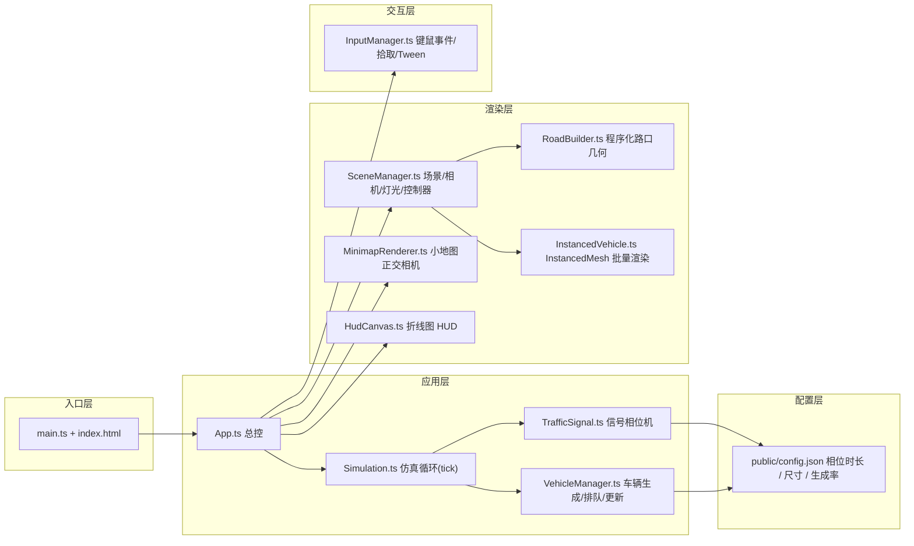

## 1. 架构设计


## 2. 技术栈描述
- **前端构建**：Vite 5 + TypeScript 5
- **3D 引擎**：three@^0.160.0（Three.js 原生，不用 R3F，不用 React）
- **控制**：`three/examples/jsm/controls/OrbitControls.js`
- **类型辅助**：`@types/three`
- **样式**：原生 CSS + `<style>` 内联（无 Tailwind，保持零额外依赖）
- **后端 / 数据库**：无，纯前端单页应用
- **初始化工具**：`npm create vite@latest . -- --template vanilla-ts`
- **脚本**：`npm run dev`（vite）、`npm run build`（tsc + vite build）

## 3. 路由定义
单页应用，无路由。`index.html` 直接挂载 `main.ts`。

## 4. 数据 / 配置模型

### 4.1 config.json 结构
```jsonc
{
  "intersection": {
    "laneWidth": 3.5,
    "lanesPerDirection": 2,
    "roadLength": 80,
    "sidewalkWidth": 4
  },
  "signal": {
    "phases": [
      { "name": "南北直行", "directions": ["N_s", "S_s"], "duration": 200, "yellow": 30 },
      { "name": "南北左转", "directions": ["N_l", "S_l"], "duration": 120, "yellow": 30 },
      { "name": "东西直行", "directions": ["E_s", "W_s"], "duration": 200, "yellow": 30 },
      { "name": "东西左转", "directions": ["E_l", "W_l"], "duration": 120, "yellow": 30 }
    ],
    "allRed": 20
  },
  "traffic": {
    "spawnRate": 0.35,
    "maxVehicles": 300,
    "cruiseSpeed": 0.35,
    "accel": 0.008,
    "decel": 0.02,
    "minGap": 4.5,
    "queueGap": 2.2
  },
  "hud": {
    "historyTicks": 60
  }
}
```

### 4.2 核心类型定义（src/types.ts）
```typescript
export type Direction = 'N' | 'S' | 'E' | 'W';
export type TurnKind = 's' | 'l';
export type LaneId = `${Direction}_${TurnKind}`;

export interface Vehicle {
  id: number;
  lane: LaneId;
  x: number;
  z: number;
  heading: number;
  speed: number;
  color: THREE.Color;
  queued: boolean;
  alive: boolean;
  turningProgress: number;
}

export type RenderMode = 'solid' | 'particle' | 'heat' | 'wireframe';
```

## 5. 模块职责清单
| 文件 | 职责 |
|------|------|
| `src/main.ts` | 挂载 App，加载 config.json |
| `src/App.ts` | 总控：初始化、主循环 (rAF)、帧调度 tick |
| `src/config.ts` | 运行时配置加载 / 类型 |
| `src/types.ts` | 全局类型 |
| `src/SceneManager.ts` | 场景 / 透视相机 / 灯光 / OrbitControls（限俯仰角）/ resize |
| `src/RoadBuilder.ts` | 程序化生成路口：路面、车道分隔线、停止线、人行道、路缘石 |
| `src/TrafficSignal.ts` | 相位状态机：推进、当前相位、黄色 / 全红切换 |
| `src/VehicleManager.ts` | 车辆生成、排队、加减速、转向、移除；每 tick 输出位置 |
| `src/InstancedVehicle.ts` | 车辆几何 + 材质 + InstancedMesh 矩阵更新 |
| `src/InputManager.ts` | 鼠标拾取（Raycaster）、键盘监听、相机 Tween |
| `src/MinimapRenderer.ts` | 小地图正交相机 + WebGLRenderTarget 离屏渲染 → DOM canvas |
| `src/HudCanvas.ts` | 选中方向 60-tick 折线图（2D canvas） |
| `src/utils/tween.ts` | easeOutCubic 等缓动函数 |
| `src/style.css` | HUD 叠加层样式、小地图样式 |
| `public/config.json` | 用户可编辑的相位 / 交通参数 |

## 6. 仿真与渲染关键约束
1. **tick 固定步长**：1 tick = 1 仿真单位，主循环按 60FPS 推进 1 tick/帧（必要时允许倍速 / 暂停）
2. **InstancedMesh**：容量 `config.traffic.maxVehicles`，每帧 `setMatrixAt` + `instanceMatrix.needsUpdate = true`
3. **排队可视化**：红灯时 stop line 前车辆 `speed→0`，沿车道紧密堆积（`queueGap`），使车队一眼可见
4. **热力模式**：根据车辆速度映射 viridis 色带写 `instanceColor`；粒子模式额外叠加 `Points`；线框模式切换 `material.wireframe`
5. **拾取**：车辆用自定义 `raycast` 命中后取 `instanceId` 改 `instanceColor`；车道为独立 `Mesh`，hover 改材质
6. **限俯仰角**：`OrbitControls.minPolarAngle = Math.PI * 0.35`，`maxPolarAngle = Math.PI * 0.48`
7. **resize**：监听 `window.resize`，同步更新主相机 aspect / renderer 和小地图 render target 尺寸
